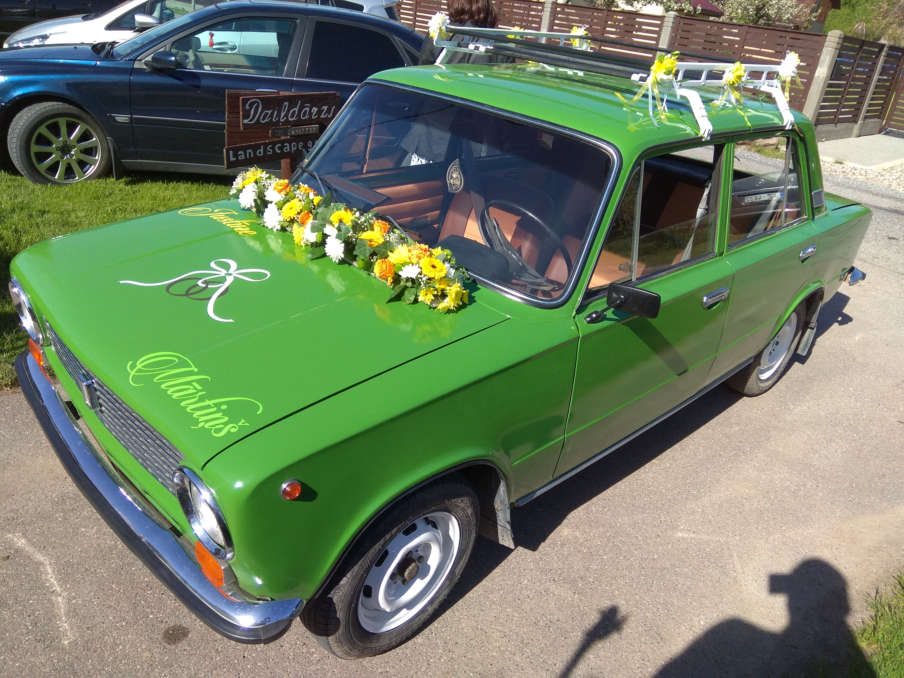

# About me

My name is Roberts. 32 years of age. Living in Jurmala for all my life with no intention to changing my home-place. Have wife and 2 beautiful children. Favourite food currently is kebab (Kebab in Berlin is the best). Currently unemployed. Using this time off from work by building new house which currently requires a lot of time and resources. Also using this time to learn new skills like these courses. In free time I do different activities like driving a motorcycle, bicycle, snowboard, travel and hike a lot.

# Previous experience

My previous work experience consists mainly of working in IT. Started by managing websites, then switched to customer support and for last couple of years have been working as QA. Testing experience is mostly working as manual QA and testing software applications and also cross-browser systems. Have passed ISTQB foundation certification.

# Going forward

As I see myself as QA in the future.I hope this course will help me with missing skills that I lacked in previous testing jobs and by developing these skills i can find my next workplace as manual QA job is not so attractive anymore.

Here's a link to [Lorem Ipsum page](https://www.lipsum.com)

Also check the cool Lada below :)

